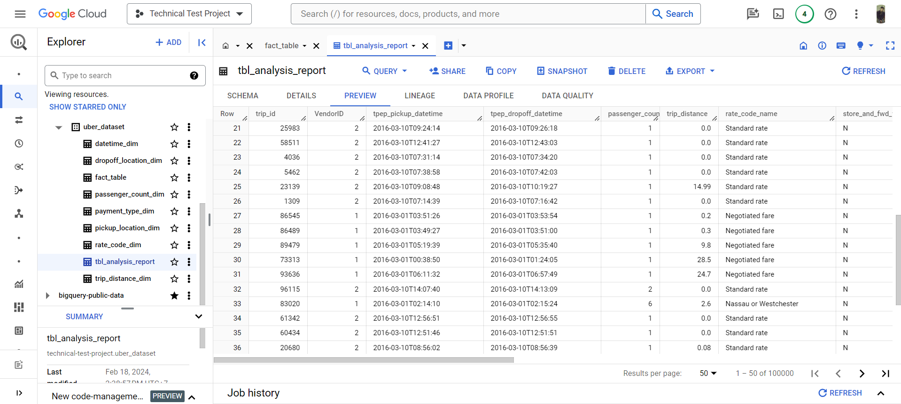
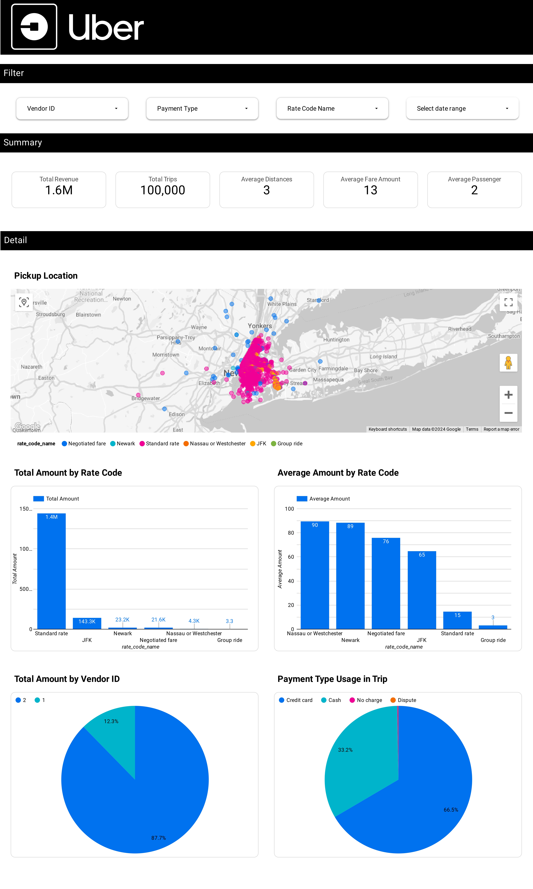

# uber-analytics-engineer-project

## Introduction 
This project aims to perform end-to-end data engineer analytics on the Uber dataset using various tools and technologies, including Google Cloud Storage, Python, Google Compute Engine, Mage Data Pipeline Tool, BigQuery, and Looker Studio. 

Executive summary: 

🔧 What I do:

    📥 Importing and loading the dataset into Google Cloud Storage
    🐍 Creating a Python notebook for data extraction and transformation
    🖥️ Creating a virtual machine instance to run Mage.ai pipeline tools
    🧙‍♂️ Creating data pipeline using Mage.ai 
    🏭 Managing data warehouse in BigQuery (dimensional, fact, and mart table concept) 
    📊 Creating a dashboard and analyzing the data 
      
📒 Notes: the dimensional data table is not necessary, but it's just for understanding the concept of a dim-fact-mart table. 

## Architecture 
🏛️ The architecture I used in this project: 

## Tools 
🔧 Tools I used in this project:

    🖥️ Google Cloud Platform
        - Google Cloud Storage 
        - Google Compute Engine 
        - Google BigQuery 
        - Google Looker Data Studio 
    🐍 Python 
    🧙‍♂️ Mage.ai 
    🗃️ SQL

## Dataset 
TLC Trip Record Data Yellow and green taxi trip records include fields capturing pick-up and drop-off dates/times, pick-up and drop-off locations, trip distances, itemized fares, rate types, payment types, and driver-reported passenger counts.

Here is the dataset used in this project - https://github.com/fadliahmad/uber-analytics-engineer-project/tree/master/data
More info about the dataset can be found here:

1. Website - https://www.nyc.gov/site/tlc/about/tlc-trip-record-data.page
2. Data Dictionary - https://www.nyc.gov/assets/tlc/downloads/pdf/data_dictionary_trip_records_yellow.pdf

## Data Model 
📑 Data modeling in this project: 

## Creating Google Cloud Storage Bucket 
📥 It's an online file storage provided as a service by GCP. It helps us store, and retrieve files from anywhere in the cloud with an internet connection.

## Creating a Virtual Machine Instance to Run Mage.ai 
🖥️ It's part of the GCP suite that helps us run virtual machines to run our applications. 
 

## Creating a Virtual Machine Instance to Run Mage.ai 
🧙‍♂️ Mage is the latest open-source tool to set up your ETL pipeline. This tool helps you with focussing only on your business logic using certain existing templates it provides to — ‘load’, ’transform’, and ‘extract’ the data. 
 

## Managing data warehouse in BigQuery 
🏭 It's a warehouse provided by Google that helps us store, and analyze large-scale data sets using a SQL-type interface and query language. 
 

## Dashboard 
🔍 Dashboard result: 
 

## Full tutorial

Big thanks to Darshil Parmar for this amazing project tutorial. 

You can find the full tutorial for this project at: https://www.youtube.com/watch?v=WpQECq5Hx9g&ab_channel=DarshilParmar 
You can find his GitHub profile here: https://github.com/darshilparmar 
